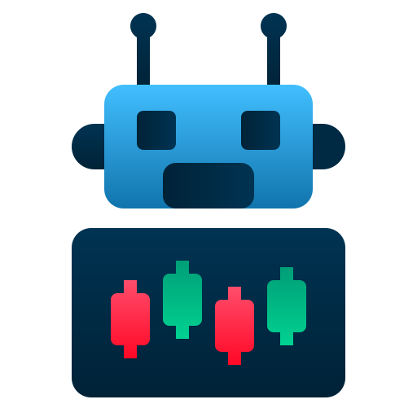

# 🤖 Repositório de Aulas de Internet das Coisas (IoT)

<p align="center">
  
</p>

Repositório com conteúdos e atividades da disciplina de **Internet das Coisas (IoT)**, abordando integração de hardware, sensores, microcontroladores e aplicações conectadas à internet.

---

## 🎯 Objetivos

- Entender fundamentos e aplicações de IoT  
- Programar microcontroladores (Arduino, ESP32)  
- Integrar sensores, atuadores e comunicação  
- Criar projetos conectados e automatizados  

---

## 🧠 Conteúdos

- Fundamentos de IoT  
- Sensores e atuadores  
- Programação de dispositivos  
- Protocolos (HTTP, MQTT, etc.)  
- Integração com nuvem e web  
- Projetos práticos e automação  

---

## 🚀 Uso

1. Clone o repositório:
   ```bash
   git clone https://github.com/LeticiaRoth/Aulas_IoT.git
